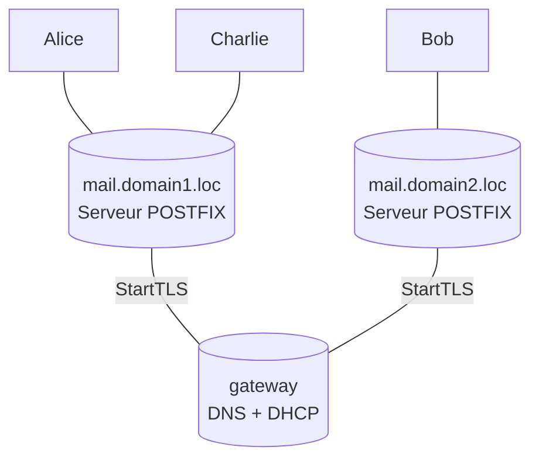

# Tuto Simple Postfix architecture


## Objectif

Monter une infra simple afin de faciliter la compréhension des protocoles de messagerie.
L'infra se veut souple pour pouvoir progressivement permettre de se complexifier.

### Architecture globale



## Mise sur pied initiale

##### L'architecture de base est la suivante:
- Alice: 1 VM sous Debian 11, avec MUA, dans le domain 1 
- Bob: 1 VM sous Debian 11, avec MUA, MSA différent de Alice (dans le domain 2)
- Charlie: Optionnel, 1 VM sous Debian 11, avec MUA, MSA de Alice (dans le domain 1)
- Mail domain 1: 1 VM sous Debian 11, avec serveur Postfix 
- Mail domain 2: 1 VM sous Debian 11, avec serveur Postfix 
- Gateway: passerelle internet/domain1/domain2

##### Réseaux mis en place:

Domaine | Machines | Réseau + masque | Remarques 
 --- | --- | --- | ---
 Domain 1 | Mail(253), Alice(1), Charlie(2), Passerelle(254) | 192.168.1.0/24 | 
 Domain 2 | Mail(253), Bob(1), Passerelle(254) | 192.168.2.0/24 | 
 

## Protocole d'installation

### Montage de la passerelle
La passerelle fournit:
- Le lien internet pour les VMs des deux domaines
- Le serveur DNS pour les deux domaines
- Le serveur DHCP pour les deux domaines
- Un moyen d'observer les échanges entre les machines


#### Création de la VM

- Créer une VM **gateway** avec les 3 interfaces suivantes:
    - `enp0s3`: interface **NAT** vers le réseau internet, bénéficie du DHCP de l'hôte.
    - `enp0s8`: interface **réseau interne** sur le réseau **domain1**.
    - `enp0s9`: interface **réseau interne** sur le réseau **domain2**.

- Créer une Debian desktop (plus user-friendly pour la configuration, le débugging et les attaques, elle servira aussi pour le SSH sur les MTA des deux domaines) avec comme nom de machine **gateway**
> Exemple de conf machine: RAM 2048Mo (utile avec le bureau graphique et pour les attaques), 2 processeurs, 128MB de mem graphique
> Installer les additions invité, ça fait gagner du temps...

- Configurer les interfaces en créant en *root* le fichier `/etc/network/interfaces.d/gateway` et en y mettant:
```squidconf
# Interface NAT internet
auto enp0s3
iface enp0s3 inet dhcp

# Interface GW sur le domain1
auto enp0s8
iface enp0s8 inet static
        address 192.168.1.254/24

# Interface GW sur le domain2
auto enp0s9
iface enp0s9 inet static
        address 192.168.2.254/24
```

- Après un `sudo apt update`, installer les applicatifs suivants: `ssh nmap net-tools dnsutils tcpdump wireshark python3-scapy terminator mitmproxy`

#### Activer le mode passerelle et prise en compte par IPtables

Editer en *root* la configuration `/etc/sysctl.conf` et modifier (décommenter) la ligne `net.ipv4.ip_forward=1`.

Installer `iptables-persistent` (répondre `OUI` au maintient des règles par défaut pendant l'install). Ceci permet de modifier plus simplement les règles de IPtables.

Modifier en *root* les règles ipv4 `/etc/iptables/rules.v4`:

```bash
*nat
-A POSTROUTING -o enp0s3 -j MASQUERADE
COMMIT

*filter
-A INPUT -i lo -j ACCEPT
# allow ssh, so that we do not lock ourselves
-A INPUT -i enp0s3 -p tcp -m tcp --dport 22 -j ACCEPT
# allow incoming traffic to the outgoing connections,
# et al for clients from the private network
-A INPUT -m state --state RELATED,ESTABLISHED -j ACCEPT
# prohibit everything else incoming 
-A INPUT -i enp0s3 -j DROP
COMMIT
```

Puis faire appliquer les règles en *root* avec `iptables-restore < /etc/iptables/rules.v4`.

> Cool tip: pour accélérer le démarrage:
> `sudo nano /etc/default/grub`, modifier le restarttimeout à 1 et exécuter `sudo update-grub` (sinon la modif n'est pas prise en compte :s)
> `sudo nano /etc/lightdm/lightdm.conf` et modifier dans la partie `[Seat:*]` la ligne `autologin-user=debian`.
> Pour l'accès à une partition, penser à `sudo usermod -aG vboxsf debian`.

#### Installer et configurer dnsmasq

> *dnsmasq* va nous simplifier la vie pour les fonctions communes de serveur de réseau (DNS, DHCP notamment)

Installation en *root* de `dnsmasq`

Modifier en *root* le fichier de conf `/etc/dnsmasq.d/domains.conf`
```apacheconf
dhcp-authoritative
domain-needed
bogus-priv
expand-hosts

# Interfaces à écouter
interface=enp0s8
interface=enp0s9
bind-interfaces

# Configuration du DHCP
domain=domain1.loc,192.168.1.0/24
local=/domain1.loc/
host-record=mail.domain1.loc,192.168.1.253
dhcp-range=interface:enp0s8,192.168.1.1,192.168.1.100,255.255.255.0
dhcp-host=mail,192.168.1.253,infinite
dhcp-option=interface:enp0s8,option:router,192.168.1.254
dhcp-option=interface:enp0s8,option:dns-server,192.168.1.254

domain=domain2.loc,192.168.2.0/24
local=/domain2.loc/
host-record=mail.domain2.loc,192.168.2.253
dhcp-range=interface:enp0s9,192.168.2.1,192.168.2.100,255.255.255.0
dhcp-host=mail,192.168.2.253,infinite
dhcp-option=interface:enp0s9,option:router,192.168.2.254
dhcp-option=interface:enp0s9,option:dns-server,192.168.2.254

server=1.1.1.1 # DNS Cloudflare
server=9.9.9.9 # DNS Quad9
```

#### DNS mon ami...
La résolution DNS est gérée par le fichier `/etc/resolv.conf`. Il est automatiquement réédité par une multitude d'applicatifs... notamment par le dhcp du réseau NAT.

En réalité, avec dnsmasq, il nous faut juste inscrire `127.0.0.1` comme résolveur de noms préféré.

Pour que cela soit pérenne, la solution est de questionner dnsmasq avant le DHCP. Cela se fait en *root* dans `/etc/dhcp/dhclient.conf` en ajoutant la ligne `prepend domain-name-servers 127.0.0.1;`.

### Montage des serveurs Postfix (MTA)

#### Installation des VMs

- Créer une VM minimale avec juste une interface en **réseau interne** sur le réseau **domain1** (enp0s3).
> Exemple de conf machine: RAM 1024Mo (utile qu'il y ait un peu de RAM), 1 processeur, 16MB de mem graphique.

- Installer une Debian minimale (tout décocher à l'install excepté le serveur SSH) avec comme nom de machine **mail**.

> Tester la connexion SSH à partir de la **gateway** avec `ssh debian@mail.domain1.loc`
> Tout le reste de l'install se fait à partir de la GW.

- On la dupliquera à la fin pour avoir nos 2 serveurs de mail (il faudra juste modifier les confs de la 2ème).

#### Base des MTA

- Installer les paquets postfix, dovecot et les utilitaires réseau.
```shell
sudo apt-get install postfix dovecot-imapd tcpdump mailutils telnet
```
> *Postfix* est un MTA libre, pendant l'install, préciser `site internet`, le restant par défaut (sera reconfiguré après).
> *dovecot* est un utilitaire qui permet de fournir des démons pour les serveurs IMAP et POP3 pour Postfix. On utilisera IMAP.
> *mailutils* contient les commandes basiques d'envoi de mail.
> *tcpdump*, *telnet*, des incontournables...

#### Configuration du Postfix

##### Postfix

Ajouter l'utilisateur comme **postmaster**, en éditant (en *root*) le fichier `/etc/aliases` (**debian** est le nom d'utilisateur de la VM mail, à adapter en fonction du cas)
```apacheconf
postmaster: root # Relaie les messages d'administration mail vers le compte root
root: debian # Relaie les messages du root vers l'utilisateur debian
```

> Ceci permet de fusionner les boites *postmaster*, *root* et *debian* dans la mailbox de *debian*.
Pour prendre en compte les changements, exécuter (en *root*) `newaliases`.

Reconfiguration Postfix, en éditant (en *root*) le fichier de conf `/etc/postfix/main.cf`

###### Pour le MTA1 (à adapter pour MTA2):
```apacheconf
relayhost = [192.168.2.253]
mynetworks = ... 192.168.1.0/24
# Activation du Maildir
home_mailbox = Maildir/
```

> **NB:** Pour shunter la résolution DNS du MX, il est nécessaire pour nous de mettre le serveur relai entre crochets...
> Il est impératif dans le cas d'une résolution DNS d'ajouter sur le serveur de noms une ligne MX 

On test la configuration Postfix (en *root*) avec `postfix check`, puis on recharge la configuration (toujours en *root*) avec `postfix reload`.

##### Test

Sur le terminal (Chaque retour à la ligne correspond à une pression sur entrée, avec une réponse du serveur en 2XX, ou 3XX pour la réponse à data) :
```shell
telnet mail.domain1.loc 25
mail from: toto
rcpt to:postmaster@domain2.loc
data
Subject: Objet du mail
Ici on met le corps du mail.
.
quit
```

> Sinon `echo "Message de test." | mail -s "Bonjour" postmaster@domain2.loc`

Pour le consulter, on regarde le contenu du fichier `cat /var/mail/debian `. S'il n'apparaît pas, c'est qu'il manque quelque chose (DNS, alias, etc).

##### Et les utilisateurs, dans tout ça?
> NB: Faire le clône des *VMs mail* avant d'ajouter les utilisateurs, sinon ils auront un compte par domaine! (avec des nouvelles adresses MAC).

Pour avoir des utilisateurs, il est nécessaire:
- [Option Bourrin] De créer autant de comptes utilisateur sur le postfix qu'on veut avoir d'utilisateurs de mail;
- [Option simple] De créer des comptes d'utilisateurs virtuels sur le serveur postfix;
- [Option upscalable] D'utiliser une BDD et de déployer un serveur de base de données (SQLite, MariaDB, mySQL, ...).
Pour des raisons pratiques, on va utiliser la deuxième option (création d'utilisateurs virtuels)...

##### Création du support commun des utilisateurs virtuels
Création d'un répertoire qui contiendra les boites mails des utilisateurs, puis création du compte *vmail* et du groupe homonyme d'accès à ce répertoire et attribution des droits idoines avec les commandes.

```shell
sudo mkdir /home/mailboxes
sudo groupadd vmail --gid 2000
sudo useradd vmail --gid vmail --uid 2000 --home /home/mailboxes
sudo chown -R vmail:vmail /home/mailboxes
```

Puis on modifie la conf postfix (`/etc/postfix/main.cf` en *root*) :
###### Pour le MTA1 (à adapter pour MTA2):
On retire de mydestination l'item `domain1.loc` et on ajoute:
```apacheconf
virtual_mailbox_domains = domain1.loc
virtual_mailbox_base = /home/mailboxes
virtual_mailbox_maps = hash:/etc/postfix/virtualmaps
virtual_uid_maps = static:2000
virtual_gid_maps = static:2000
```

##### Création du mapping des utilisateurs
On crée le fichier (en *root*)  `/etc/postfix/virtualmaps` et on y ajoute les utilisateurs (sous la forme `<adresse> <nomDuRepertoire>`):
###### Pour le MTA1 (à adapter pour MTA2):
```shell
alice@domain1.loc alice/
charlie@domain1.loc charlie/
debian@domain1.loc debian/
```

Appliquer les modifications en *root* via la commande `postmap /etc/postfix/virtualmaps` et relancer le serveur postfix (en *root* `postfix reload`).

#### Paramétrage Dovecot pour l'IMAP (+ authentification SMTP via Dovecot)

- Configurer *postfix* pour déléguer à *dovecot* l'authentification et le relais des messages, en éditant la configuration (en *root*) `/etc/postfix/main.cf` et en ajoutant les lignes:
```apacheconf

virtual_transport = dovecot
dovecot_destination_recipient_limit = 1
smtpd_sasl_type = dovecot
smtpd_sasl_path = private/auth
smtpd_sasl_auth_enable = yes
```
<!-- Et modifier la ligne ̀`smtpd_relay_restrictions` ainsi: `smtpd_relay_restrictions = permit_mynetworks permit_sasl_authenticated reject_unauth_destination`. -->

- Ajouter (en *root*) les commandes *dovecot* pour *postfix* dans le fichier `/etc/postfix/master.cf`, ajouter les lignes:
```squidconf
dovecot unix    -       n       n       -       -       pipe
  flags=DRhu user=vmail:vmail argv=/usr/lib/dovecot/dovecot-lda -f ${sender} -a ${original_recipient} -d ${user}
```

- Ouvrir en *root* le fichier `/etc/dovecot/dovecot.conf` et désactiver la conf par défaut en commentant la ligne `!include conf.d/*.conf`.

- Créer (en *root*) une nouvelle configuration pour *Dovecot* avec un `/etc/dovecot/local.conf` et y ajouter les lignes:

```apacheconf
protocols = imap
#imaps pop3

# Fichiers de log
log_path = /var/log/dovecot.log
info_log_path = /var/log/dovecot-info.log

# Authentification SASL
disable_plaintext_auth = no
auth_mechanisms = plain
auth_verbose = yes
auth_default_realm = domain1.loc
# Sources d'authentification
passdb {
        driver = passwd-file
        args = /etc/dovecot/users
}
userdb {
        driver = static
        args = uid=virtualmail gid=virtualmail home=/home/mailboxes/%n
}

# Paramètres SSL
ssl = yes
ssl_cert = </etc/dovecot/private/dovecot.pem
ssl_client_ca_dir = /etc/ssl/certs
ssl_dh = </usr/share/dovecot/dh.pem
ssl_key = </etc/dovecot/private/dovecot.key

# Format de la boite de réception en Maildir
mail_location = maildir:/home/mailboxes/%n/Maildir
namespace inbox {
  inbox = yes
  location =
  mailbox Drafts {
    auto = subscribe
    special_use = \Drafts
  }
  mailbox Junk {
    auto = subscribe
    special_use = \Junk
  }
  mailbox Sent {
    auto = subscribe
    special_use = \Sent
  }
  mailbox "Sent Messages" {
    special_use = \Sent
  }
  mailbox Trash {
    auto = subscribe
    special_use = \Trash
  }
  prefix =
}

# Création du socket d'utilisation de l'authentification Dovecot dans postfix
service auth {
  unix_listener /var/spool/postfix/private/auth {
    mode = 0660
    user = postfix
    group = postfix
  }
}
```

- Ajouter les *credentials* d'utilisateurs:
Générer le mot de passe en *root* avec `doveadm pw -s plain-md5` pour obtenir le hash (pourri en plain md5), puis l'intégrer (en *root*) dans le fichier `/etc/dovecot/users`:
```squidconf
bob@domain2.loc:{PLAIN-MD5}9f9d51bc70ef21ca5c14f307980a29d8::::::
```
> Format de la ligne:
> `user@domain:{HASH_ALGO}passwd_hash:UID:GID`

En *root*, Recharger postfix (`postfix reload`), vérifier la conf Dovecot (`dovecot -n`), l'authentification (`doveadm auth test alice`), la déployer (`systemctl restart dovecot`) et contrôler qu'elle tourne (`systemctl status dovecot`).

#### Durcir la conf postfix

##### Options générales utiles
Quelques options utiles à ajouter au /etc/postfix/main.cf:
- `biff = no` => impact sur les performances si laissé actif avec beaucoup d'utilisateurs, joue sur la disponibilité
- `append_dot_mydomain = no` => ajoute le nom de domaine sur les messages en local qui n'en ont pas. A partir de la v3 de postfix, c'est `no` par défaut.
- `smtpd_relay_restrictions = defer_unauth_destination` => rejette les messages qui ne le concernent pas avec un code temporaire (on peut utiliser *reject* à la place de *defer* pour avoir un code d'erreur permanent).

##### Contrôler l'accès SMTP
- `smtpd_helo_required = yes` => impose un helo/ehlo avant toute connexion SMTP.
  > On peut également s'assurer que le ehlo est conforme à la rfc (du moins d'un point de vue syntaxique) avec les configurations:
  > ``` squidconf
  > smtpd_helo_restrictions =
  >     reject_invalid_helo_hostname,
  >     reject_non_fqdn_helo_hostname
  > ```

##### Contrôler le nom du destinataire
- Postfix peut contrôler que le destinataire a bien une adresse complète, et appartient bien aux utilisateurs connus (dans le cas contraire, Postfix va garder le message pour un destinataire inexistant...):
  ```squidconf
  smtpd_recipient_restrictions =
    reject_unlisted_recipient,
    reject_non_fqdn_recipient
  ```

### Montage des utilisateurs (MUA)

#### Création de VM

- Créer une Debian desktop avec comme nom de machine et d'utilisteur **alice** (plus simple pour la suite: on pourra accéder à la machine plus simplement)
> Exemple de conf machine: RAM 1024Mo, 1 CPU, 128MB de mem graphique => C'est suffisant pour une xfce...
- 1 interface réseau, sur **domain1** ou **domain2** (en fonction=> alterner entre les utilisateurs).

- Installer une machine (Debian Desktop Xfce > moins gourmand) avec un compte **alice**.

> Réitérer le process pour tous les utilisateurs (y compris les étapes ci-dessous)

#### Base des MUA

- Installer le paquet Thunderbird
```shell
sudo apt-get install thunderbird
```
> Installer les additions invité, ça fait gagner du temps...

> Ajouter l'utilisateurs aux groupes *sudo* et *vboxsf*:
> ```shell
> su
> sudo usermod -aG sudo,vboxsf <user>
> sudo reboot
> ```

#### Configuration des MUA

##### Interface

La configuration de l'interface réseau se fait normalement par DHCP. Si la connexion ne se fait pas:
- Contrôler la conf network (`/etc/network/interfaces`) et y ajouter la conf DHCP sur l'interface concernée:
```squidconf
auto enp0s3
iface enp0s3 inet dhcp
```
- Puis relancer le service:  
```bash 
sudo systemctl restart networking
```


##### Ajout des certificats S/MIME

Génerer des certificats avec une AC auto-signée, puis générer les certificats de Alice et de Bob.
> **Important:** Certificats
> 
> *Root CA configuration:* Export PEM
> - nsComment=xca certificate
> - nsCertType=sslCA, emailCA, objCA
> - keyUsage=critical,keyCertSign, cRLSign
> - subjectKeyIdentifier=hash
> - basicConstraints=critical,CA:TRUE
> 
> *Alice cert conf:* Export #PKCS12 pour Alice et PEM pour Bob et Charlie
> - nsComment=xca certificate
> - nsCertType=client, email
> - subjectAltName=DNS:alice@domain1.loc, email:alice@domain1.loc
> - extendedKeyUsage=clienAuth, emailProtection
> - keyUsage=digitalSignature, nonRepudiation, keyEncipherment, dataEncipherment, keyAgreement
> - subjectKeyIdentifier=hash
> - basicConstraints=critical,CA:FALSE
> 
> *Bob cert conf:* Export #PKCS12 pour Bob et PEM pour Alice et Charlie
> - nsComment=xca certificate
> - nsCertType=client, email
> - subjectAltName=DNS:bob@domain2.loc, email:bob@domain2.loc
> - extendedKeyUsage=clientAuth, emailProtection
> - keyUsage=digitalSignature, nonRepudiation, keyEncipherment, dataEncipherment, keyAgreement
> - subjectKeyIdentifier=hash
> - basicConstraints=critical,CA:FALSE
> 
> *Charlie cert conf:* Export #PKCS12 pour Charlie et PEM pour Alice et Bob
> - nsComment=xca certificate
> - nsCertType=client, email
> - subjectAltName=DNS:charlie@domain1.loc, email:charlie@domain1.loc
> - extendedKeyUsage=clientAuth, emailProtection
> - keyUsage=digitalSignature, nonRepudiation, keyEncipherment, dataEncipherment, keyAgreement
> - subjectKeyIdentifier=hash
> - basicConstraints=critical,CA:FALSE


Pour les ajouter sur les Thunderbird:
1. Menu (Les 3 barres...) > `Account Settings` > Onglet `End-To-End Encryption`
2. § `S/MIME`, cliquer sur `Manage S/MIME Certificates`
   1. Dans l'onglet `Your Certificates`, cliquer sur `Import...` puis sélectionner le fichier P12 de l'utilisateur concerné (et mettre le MdP correspondant).
   2. Dans l'onglet `People`, `Import...`, ajouter les CRT des autres utilisateurs.
   3. Dans l'onglet `Authorities`, `Import...`, ajouter le CRT du *Root CA*, puis cliquer sur `OK` (*NB:*Il existe sans doute déja, importé avec le P12)
   4. !!! Onglet `Authorities`, sélectionner le certificat du *Root CA*, `Edit trust...`, cocher `This certificate can identify mail users` !!!
3. De retour dans le § `S/MIME`, item `Personal certificate for digital signing`, `Select...`, sélectionner l'utilisateur (*NB:*il ne doit y en avoir qu'un logiquement...)
4. Une pop-up vous propose de prendre le même certificat pour le chiffrement, dans le cas contraire même manip avec l'item `Personal certificate for encryption`.
5. Il est possible de choisir de signer par défaut ses messages, ou de les chiffrer.

> **NB:** Ajout d'un répertoire partagé sous VBox:
> 1. Ajouter les additions invités
> 2. Ne pas oublier le sudo `useradd -aG vboxsf <user>`
> 3. Puis `sudo reboot`

## Configuration de l'attaquant

Matricer une debian 11 avec 2 interfaces (`enp0s3` sur le réseau `Domaine1` avec MTA1 et `enp0s8` sur le réseau `Domaine2` avec MTA2).

### Logiciels utiles

- traceroute (apt install net-tools)
- TCPDump
- BurpSuite  impacket mitmproxy 
- Python3


# What's next? Exploitation de la plateforme

## Obtenir un PCAP

### TCPDump

Pour faire un PCAP uniquement sur le port 25 et l'enregistrer dans un fichier (avec un nom horodaté...)
`tcpdump -w $(date +"%Y%m%d-%H%M%S_SMTP.pcap") port 25`

## Déploiement BIND9 pour utilisation DNS avancée (DNSSec/SPF/DKIM/DMARC)

### Nouveau DHCP:
`sudo apt purge dnsmasq && sudo apt install isc-dhcp-server`

`sudo nano /etc/default/isc-dhcp-server` et on modifie `INTERFACESv4="enp0s8 enp0s9"`

Puis on édite la conf `/etc/dhcp/dhcpd.conf` de la façon suivante
```squidconf
authoritative

subnet 192.168.1.0 netmask 255.255.255.0 {
  option domain-name "domain1.loc";
  option domain-name-servers dns.domain1.loc, 10.0.2.3;
  range 192.168.1.1 192.168.1.10;
  option routers gateway.domain1.loc
}

subnet 192.168.2.0 netmask 255.255.255.0 {
  option domain-name "domain2.loc";
  option domain-name-servers dns.domain2.loc, 10.0.2.3;
  range 192.168.2.1 192.168.2.10;
  option routers gateway.domain2.loc
}

host mail.domain1.loc {
  hardware ethernet 08:00:27:EF:E3:FA;
  fixed-address mail.domain1.loc;
}

host mail.domain2.loc {
  hardware ethernet 08:00:27:9A:66:FB;
  fixed-address mail.domain2.loc;
}
```

> NB: Le `10.0.2.3` est l'@ du DNS de la plateforme Virtualbox. On la trouve dans le fichier `/etc/hosts`.
  Il permet de requêter le DNS d'accès à internet, sachant que le DNS de `domain1.loc` et `domain2.loc` sera autoritative sur ses zones, mais pas pour les zones externes.

Et on relance le service DHCP pour confirmer qu'il démarre correctement (`sudo systemctl restart isc-dhcp-server` puis `sudo systemctl status isc-dhcp-server` doit être en `active (running)`).

### Installer BIND9

Le serveur DNS le plus répandu est BIND (version 9). Il est open-source sous Linux. On l'obtient par le gestionnaire de paquets avec Debian:
`sudo apt install bind9`

### Configurer BIND9

#### `/etc/bind/named.conf.options`: options du serveur DNS

ajouter/modifier les lignes:
```squidconf
acl platform {
  192.168.1.0/24;
  192.168.2.0/24;
  localhost;
  localnets;
};

options {
	directory "/var/cache/bind";
	version "not currently available";

	dnssec-validation auto;
	auth-nxdomain no;

	listen-on { 192.168.1.254; 192.168.2.254; 127.0.0.1; };

	allow-query { platform; };
	recursion no;
};
```
> NB: Le serveur DNS bind a plusieurs types de fonctionnement:
  - `Forwarder` ou `cache` : il gère la résolution DNS en faisant une résolution récursive, et accessoirement fait office de cache DNS pour accélérer la résolution d'adresse.
  - `autoritative` : il répond pour les zones configurées (c'est ce que l'on veut!).

#### Fichiers de zones DNS
Pour chaque zone, 2 fichiers:
- Un pour la résolution standard;
- Un pour la résolution inverse;

##### Zone domain1.loc
###### Résolution standard:
```bash
cat  <<EOF | sudo tee /etc/bind/db.domain1.loc > /dev/null
\$TTL 3600

@       IN  SOA gateway.domain1.loc. root.domain1.loc. (
    1001    ; serial
    3600    ; refresh 1h
    600     ; retry 10min
    86400   ; expire 1j
    3600 )  ; negative cache TTL 1h
;

@       IN  NS  gateway.domain1.loc.
@       IN  MX  10  mail.domain1.loc.

gateway IN  A   192.168.1.254
mail    IN  A   192.168.1.253

dns     IN  CNAME  gateway
EOF
```

###### Résolution inverse:
```bash
cat  <<EOF | sudo tee /etc/bind/db.1.168.192.loc > /dev/null
\$TTL 3600

@       IN  SOA gateway.domain1.loc. root.domain1.loc. (
    1011    ; serial
    3600    ; refresh 1h
    600     ; retry 10min
    86400   ; expire 1j
    3600 )  ; negative cache TTL 1h
;

@       IN  NS  dns.domain1.loc.
254     IN  PTR gateway.domain1.loc.
253     IN  PTR mail.domain1.loc.
EOF
```

##### Zone domain2.loc
###### Résolution standard:
```bash
cat  <<EOF | sudo tee /etc/bind/db.domain2.loc > /dev/null
\$TTL 3600

@       IN  SOA gateway.domain2.loc. root.domain2.loc. (
    1002    ; serial
    3600    ; refresh 1h
    600     ; retry 10min
    86400   ; expire 1j
    3600 )  ; negative cache TTL 1h
;

@       IN  NS  gateway.domain2.loc.
@       IN  MX  10  mail.domain2.loc.

gateway IN  A   192.168.2.254
mail    IN  A   192.168.2.253

dns     IN  CNAME  gateway
EOF
```

###### Résolution inverse:
```bash
cat  <<EOF | sudo tee /etc/bind/db.2.168.192.loc > /dev/null
\$TTL 3600

@       IN  SOA gateway.domain2.loc. root.domain2.loc. (
    1012    ; serial
    3600    ; refresh 1h
    600     ; retry 10min
    86400   ; expire 1j
    3600 )  ; negative cache TTL 1h
;

@       IN  NS  dns.domain2.loc.
254     IN  PTR gateway.domain2.loc.
253     IN  PTR mail.domain2.loc.
EOF
```

##### Déclaration des zones
On édite le fichier `/etc/named.conf.local` et on ajoute:
```bash
cat  <<EOF | sudo tee -a /etc/bind/named.conf.local > /dev/null
zone "domain1.loc" {
  type master;
  file "/etc/bind/db.domain1.loc";
};

zone "1.168.192.in-addr.arpa" {
  type master;
  file "/etc/bind/db.1.168.192.loc";
};

zone "domain2.loc" {
  type master;
  file "/etc/bind/db.domain2.loc";
};

zone "2.168.192.in-addr.arpa" {
  type master;
  file "/etc/bind/db.2.168.192.loc";
};
EOF
```

Puis `sudo rndc reload`.

> Utiliser `nslookup` ou `dig` pour checker la résolution + inverse, e.g.:
  - `dig mail.domain1.loc` = Très verbeux
  - `dig mail.domain1.loc +short` = ne retourne que la réponse (ou rien)
  - `dig -x 192.168.1.253 +short` = résolution inverse
  - `dig domain1.loc -t mx` = l'enregistrement MX de domain1.loc(le `-t` peut être omis)


### Ajout SPF (difficulté :hammer:)

#### Installation sur le serveur mail

##### Préparation

Obtention du module SPF (Python) à postfix:
```bash
sudo apt install postfix-policyd-spf-python
```
> Il existe un module similaire en PERL (non testé).

##### Configuration de Postfix

Ajout du démon SPF à Postfix dans `/etc/postfix/master.cf`:
  ```bash
  cat  <<EOF | sudo tee -a /etc/postfix/master.cf
  policyd-spf unix  - n n - 0 spawn user=nobody argv=/usr/bin/policyd-spf
  EOF
  ```

On ajoute également dans la configuration postfix (`main.cf`):
- `policyd-spf_time_limit = 3600` et
- dans `smtpd_recipient_restrictions` les items `reject_unauth_destination` (pour éviter un contournement de la politique) et `check_policy_service unix:private/policyd-spf`.

Puis on redémarre le PostFix (`sudo postfix reload`).

#### Ajout de l'enregistrement DNS pour SPF

Sur le serveur DNS, ajouter l'enregistrement suivant dans le fichier idoine (`db.domainX.loc`):
```squidconf
@	IN  TXT "v=spf1 mx -all"
```
Cela permet d'ajouter par défaut tous les enregistrement MX comme légitimes pour émettre des e-mails. Des configurations plus précises de SPF sont possibles (se référer à la doc).
> Après un `sudo rndc reload` on peut vérifier le retour du dns avec un `dig domainX.loc -t txt +short`

#### Test

Envoyer un message entre Alice (dans *domain1.loc*) et Bob (dans *domain2.loc*). Tout est transparent au niveau de la réception du message, si ce n'est qu'un champ `Received-SPF: Pass` est notifié dans les headers (visible dans le code source du message, `ctrl+U` sur Thunderbird).

### Ajout de DKIM (difficulté :hammer::hammer:)

#### Installation sur le serveur mail

##### Préparation

Téléchargement de l'implémentation open-source de DKIM :
```bash
sudo apt install opendkim opendkim-tools
```

#### Configuration du DNS

##### Génération du certificat de signature DKIM sur le MTA
Générer la clé privée et publique (certificat pour l'enregistrement DNS):
```bash
sudo -u opendkim opendkim-genkey -D /etc/dkimkeys/ -d domainX.loc -s mail
```
> **NB1** : A générer avec l'utilisateur opendkim!
  **NB2** : Modifier le domainX.loc...

Puis récupérer la clé publique pour l'enregistrement DNS:
```bash
sudo cat /etc/dkimkeys/mail.txt
```

##### Sur le DNS

Se connecter sur le serveur DNS et ajouter l'enregistrement TXT dans le ficher correspondant (`/etc/bind/db.domainX.loc`) tel que donné par le fichier `mail.txt`.
Recharger le DNS avec `sudo rndc reload`.

> **NB** : On peut contrôler l'enregistrement DKIM dans le DNS avec un `dig -t txt sur mail._domainkey.domainX.loc`.

> L'enregistrement DNS peut être donné sur plusieurs lignes. Le laisser tel quel.
  En effet, un enregistrement DNS TXT est généralement limité à 256 carcatères. S'il est plus long il est scindé en parties de 256 octets qui sont exploités successivement dans la réponse.

#### Configuration de OpenDKIM

Editer le fichier `/etc/opendkim.conf` :
- Doivent apparaître:
  ```squidconf
  LogWhy yes
  Mode sv

  Socket local:/var/spool/postfix/opendkim/opendkim.sock

  Nameservers 192.168.X.254

  Domain                  domainX.loc
  Selector                mail
  KeyFile                 /etc/dkimkeys/mail.private
  ```
  > Remplacer les X par ka valeur correspondante.
- Commenter `TrustAnchorFile ...` (utilisé uniquement pour le DNSSEC).
- Créer le répertoire du socket partagé avec Postfix:
  ```bash
  sudo mkdir /var/spool/postfix/opendkim
  sudo chown opendkim:postfix /var/spool/postfix/opendkim
  ```
- Dans `/etc/default/opendkim`, vérifier la définition du `RUNDIR=/var/spool/postfix/opendkim`

On relance ensuite le service `opendkim`.

Pour tester le fonctionnement nominal d'openDKIM, lancer la commande:
```bash
sudo opendkim-testkey -d domainX.loc -s mail -vvv
```
> Parmi les résultats, on peut constater :
  `opendkim-testkey: key not secure`  => Normal (pas DNSSEC)
  `opendkim-testkey: key OK`  => Rassurant, cela fonctionne.

##### Connexion avec Postfix

Il s'agit maintenant d'ajouter DKIM au serveur MTA *Postfix*.

On exécute à cet effet la commande suivante pour ajouter les lignes en question à la conf postfix :
```bash
cat <<EOF | sudo tee -a /etc/postfix/main.cf
milter_default_action = accept
smtpd_milters = local:opendkim/opendkim.sock
non_smtpd_milters = $smtpd_milters
EOF
```

Puis recharger la configuration *Postfix* avec la commande `sudo postfix reload`.

#### Test

Une fois les deux MTA configurés, envoyer un message de Alice à Bob. 
On constate :
- la présence de la signature DKIM (ajoutée par le MTA émetteur);
- le contrôle de la signature DKIM à la réception (ajouté par le MTA récepteur, confirmant que la signature est bonne sur les champs concernés).

### Ajout de DNSSEC

> Nous allons configurer le mode automatique *de maintenance* de DNSSEC avec bind: il crée et gère les clés par lui-même, pas de chaine de confiance (*chain of trust*), ce qui est cependant la raison d'être de DNSSEC mais nous arrage dans le cadre d'une plateforme locale qui ne s'inclue pas dans la *chain of trust* de l'Internet...

#### Reconfiguration de Bind
Sur la gateway, on ajoute les options suivantes (dans `/etc/bind/named.conf.option`):
```squidconf
dnssec-validation auto;
recursion no;
```
Cela permet d'activer la validation DNSSEC récursive.

Il faut ensuite activer le DNSSEC sur l'ensemble des zones.

Cependant, pour utiliser le management automatique des clés par Bind, il convient de déplacer les zones dans un répertoire où bind aura accès en lecture/écriture.  

> Sous linux, Apparmor limite ces accès...
  Pour Bind, on peut voir les répertoires auxquels il a accès avec un `cat /etc/apparmor.d/usr.sbin.named`.

A cet effet, on déplace dans un premier temps nos fichiers de zone existants dans `/var/cache/bind` :
```bash
sudo cp /etc/bind/db.domain* /var/cache/bind/ &&\
sudo cp /etc/bind/db.*.192.loc /var/cache/bind/
```

Puis on modifie le `/etc/bind/named.conf.local` pour prendre en compte les nouveaux chemins et intégrer le DNSSEC:
```bash
cat  <<EOF | sudo tee /etc/bind/named.conf.local > /dev/null
zone "domain1.loc" {
  type master;
  file "/var/cache/bind/db.domain1.loc";
  dnssec-policy default;
  inline-signing yes;
};

zone "1.168.192.in-addr.arpa" {
  type master;
  file "/var/cache/bind/db.1.168.192.loc";
  dnssec-policy default;
  inline-signing yes;
};

zone "domain2.loc" {
  type master;
  file "/var/cache/bind/db.domain2.loc";
  dnssec-policy default;
  inline-signing yes;
};

zone "2.168.192.in-addr.arpa" {
  type master;
  file "/var/cache/bind/db.2.168.192.loc";
  dnssec-policy default;
  inline-signing yes;
};
```

Enfin, on recharge la conf avec `sudo rndc reload`

#### Ajout des clés en local sur les serveurs mail:

1. Récupérer les clés de chacun des domaines produites par BIND avec la commande :
  ```bash
  dig DNSKEY domain1.loc | grep -P "DNSKEY\t"
  ```
2. Les insérer dans le fichier `/usr/share/dns/root.key`.
3. Activer le DNSSEC en décommentant la ligne `TrustAnchorFile /usr/share/dns/root.key`
4. Recharger *opendkim* avec un `sudo systemctl restart opendkim`


#### Test du DNSSEC

On peut tester le fonctionnement de DNSSEC avec:
- Résolution DNS: `dig @192.168.1.254 +dnssec +multiline -t A gateway.domain1.loc +short`
- Résolution DNS - clé publique: `dig @192.168.1.254 DNSKEY domain1.loc +short`
- Résolution inverse: `dig @192.168.1.254 +dnssec +multiline -x 192.168.2.253 +short`

On doit voir apparaître la signature (ligne `RRSIG` si `dig` verbeux, `PTR` avec signature en B64 si `dig +short`).

##### Vérification de signature: 

Sur le serveur mail, on peut tester la bonne validation DNS avec DKIM en utilisant `sudo opendkim-testkey -d domain1.loc -s mail -vvv` (on doit avoir le `key secure`/`key OK`).

Avec `delv` (résolveur DNSSEC), il faut shunter le passage par le *trusted anchor* `.`:
1. Créer le fichier de clés
  ```bash
  cat <<EOF | tee keys
  trust-anchors {
  domain1.loc.	static-key $(dig DNSKEY domain1.loc +short);
  domain2.loc.	static-key $(dig DNSKEY domain2.loc +short);
  };
  EOF
  ```
2. Ajouter des doubles quotes (`"`) à chacune des clés
3. Indiquer à delv où sont les clés et shunter la résolution `root`:
  ```bash
  delv @192.168.1.254 domain1.loc -t MX -a keys +root=domain1.loc
  ```

### Ajout de DMARC


